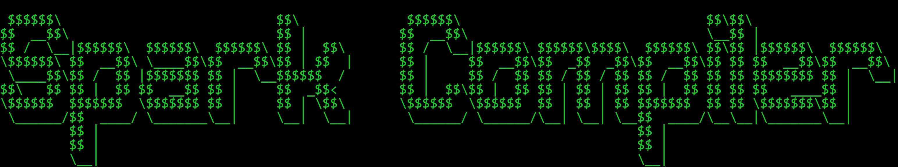

# Spark Compilator



A fast and efficient compiler built with Bun runtime.

## Quick Start

### 1. Installation
Install project dependencies:
```bash
bun install
```

### 2. Create Your Script
- Add your script files in the `/script` folder
- Use the `.spk` extension

### 3. Compilation Options

#### Basic Compilation
```bash
bun run start:file your_file_name
```
Note: `.spk` extension is optional

#### Debug Mode
```bash
bun run start:debug your_file_name
```

#### Advanced Usage
For custom compilation with flags:
```bash
bun run start:dev --file your_file_name
```

#### Example Scripts
Try example scripts:
```bash
bun run start:exemple example_name
```

## Use CLI system

#### 1. Install Bun

- Windows:
```bash
powershell -c "irm bun.sh/install.ps1 | iex"
```
- Mac/Linux
```bash
curl -fsSL https://bun.sh/install | bash
```

#### 2. git clone this project

```bash
git clone https://github.com/IGSparkew/Spark-Compiler.git
```

#### 3. install project

```bash
bun install
```

#### 4. Link to global bun dependencies
use this command in **sparkcompiler folder**

```bash
bun link
```

#### 5. run spk command to compiler on desktop your .spk file

```bash
spk --file file_name
```


## Available Flags

| Flag | Description |
|------|-------------|
| `--file` | Specify input file (defaults to `/script` folder) |
| `--debug` | Enable step-by-step debugging |
| `--ascii` | Disable ASCII art output |
| `--exemple` | Use examples from `/exemple` folder |
| `--folder` | Use this with **spk command (CLI)** to put folder name |

## About

made by IGSpakew

Built with [Bun](https://bun.sh) v1.2.6 - A fast all-in-one JavaScript runtime.
